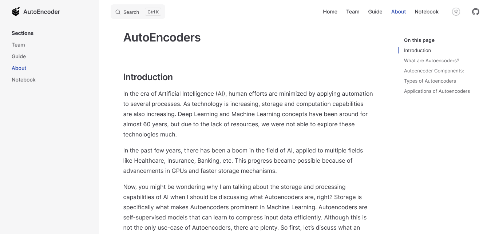

# AutoEncoder


AutoEncoder is a project focused on noise removal techniques. What makes it the best choice for de-noising is that it does not require any human interaction. Once trained on any kind of data, it can reproduce that data with less noise than the original image.

## Team Members

1. Pooja (2022179030)
2. Kamaleshwar (2022179040)
3. Siva Prakash (2022179054)

## Installation

Clone the repository using `git`

```
git clone https://github.com/Prakashdeveloper03/AutoEncoder.git
```

Change to the cloned directory

```
cd <directory_name>
```

To install all requirement packages for the application

```
pnpm install
```

Then, Run the application

```
pnpm run docs:dev
```

## 📷 Screenshots

### Home section


### About section



### Notebook section


### Demo GIF


