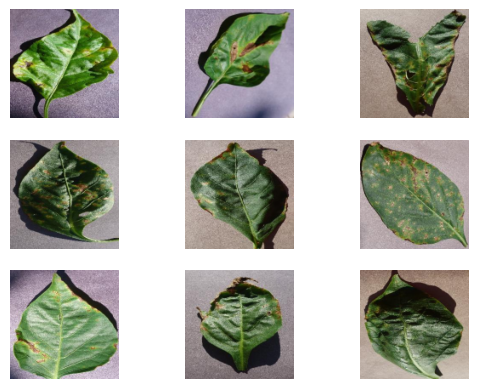
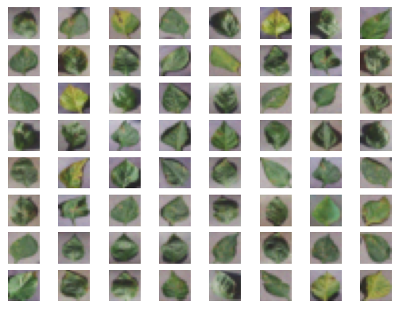
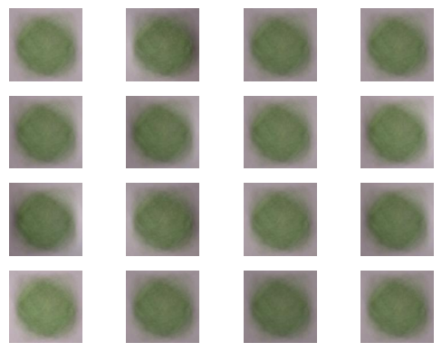

# Image File Compression

## Introduction

Using Autoencoders we can compress image files which are great for sharing and saving in a faster and more memory efficient way. These compressed images contain the key information same as in original images but in a compressed format that can be used further for other reconstructions and transformations.

We will create a simple Autoencoder that can compress the image file for the PlantVillage dataset, by using the following mechanism:

## Data Collection

#### Install gdown:

```sh
!pip install -q gdown
```

Installs the gdown package, a tool for downloading large files from Google Drive using a simple command.

#### Download a file from Google Drive using gdown:

```sh
!gdown 129DMIRtu7ho-k5O1xtO_xwjy-tEC-Pzt
```

Uses gdown to download a file from Google Drive. The argument `129DMIRtu7ho-k5O1xtO_xwjy-tEC-Pzt` is the file ID, and gdown resolves it to the actual file and downloads it. In this specific case, it seems like it's downloading a zip file named PlantVillage_Noisy_Dataset.zip.

#### Remove existing directory:

```sh
!rm -rf /kaggle/working/PlantVillage/
```

Removes the directory PlantVillage and its contents from the specified path (/kaggle/working/). The -rf flags indicate a forceful and recursive removal, ensuring that the directory is deleted even if it contains subdirectories and files.

#### Unzip the downloaded file:

```sh
!unzip -q /kaggle/working/PlantVillage_Noisy_Dataset.zip
```

Unzips the previously downloaded file (PlantVillage_Noisy_Dataset.zip) in the specified directory (/kaggle/working/). The -q flag stands for quiet mode, which suppresses the output during extraction.

## Data Preparation

#### Ignore Warnings:

```python
import warnings
warnings.filterwarnings("ignore")
```

Suppresses all warning messages during the execution of the subsequent code by setting the warning filter to "ignore."

#### Data Resizing and Conversion:

```python
import numpy as np
from glob import glob
from skimage.io import imread
from skimage.transform import resize

data = glob("./PlantVillage/Noisy_Dataset/Train_Data/P*/*")

# Use list comprehension to read and resize images
images = [resize(imread(file), (16, 16, 3), anti_aliasing=True) for file in data]

# Converting the images into float32 array
images_arr = np.asarray(images, dtype="float32")
print("Dataset:", images_arr.shape)
```

Uses glob to obtain a list of file paths matching the specified pattern. Reads and resizes the images using list comprehension. Converts the list of images into a numpy array of type `float32`.
Prints the shape of the resulting dataset.

#### Compose and Resize Images:

```python
from torchvision.datasets import ImageFolder
from torchvision.transforms import Compose, Resize, ToTensor

transf = Compose([Resize((128, 128)), ToTensor()])
noise_train = ImageFolder("./PlantVillage/Noisy_Dataset/Train_Data/", transform=transf)
pure_train = ImageFolder("./PlantVillage/Pure_Dataset/Train_Data/", transform=transf)
noise_test = ImageFolder("./PlantVillage/Noisy_Dataset/Test_Data/", transform=transf)
pure_test = ImageFolder("./PlantVillage/Pure_Dataset/Test_Data/", transform=transf)
```

Uses the ImageFolder class from torchvision.datasets to create PyTorch datasets from image folders. The Compose function is used to define a series of image transformations, including resizing images to `(128, 128)` and converting them to tensors. Datasets (noise_train, pure_train, noise_test, and pure_test) are created with specified transformations.

#### Pure Train Dataset

```python
pure_data = glob("./PlantVillage/Pure_Dataset/Train_Data/P*/*")

# Use list comprehension to read and resize images
pure_images = [
    resize(imread(file), (128, 128, 3), anti_aliasing=True) for file in pure_data
]

# Converting the images into float32 array
images_pure = np.asarray(pure_images, dtype="float32")
print("Dataset:", images_pure.shape)
```

Similar to noisy train dataset conversion, but for the pure train dataset, it reads and resizes images and converts them into a numpy array of type `float32`.

Visualize 9 images from the pure train dataset in a 3x3 grid.

```python
import matplotlib.pyplot as plt

for i in range(9):
    plt.subplot(3, 3, i + 1)
    plt.axis("off")
    plt.imshow(images_pure[i], cmap="gray")
```


#### Noisy Test Dataset

```python
test_data = glob("./PlantVillage/Noisy_Dataset/Test_Data/P*/*")

# Use list comprehension to read and resize images
images = [resize(imread(file), (128, 128, 3), anti_aliasing=True) for file in test_data]

# Converting the images into float32 array
images_test = np.asarray(images, dtype="float32")
print("Dataset:", images_test.shape)
```

Similar to noisy train dataset conversion, but for the noisy test dataset, it reads and resizes images and converts them into a numpy array of type `float32`.

#### Visualize Images

Visualize 9 images from the noisy test dataset in a 3x3 grid.

```python
for i in range(9):
    plt.subplot(3, 3, i + 1)
    plt.axis("off")
    plt.imshow(images_test[i], cmap="gray")
```


#### Pure Test Dataset

```python
test_data = glob("./PlantVillage/Pure_Dataset/Test_Data/P*/*")

# Use list comprehension to read and resize images
images = [resize(imread(file), (128, 128, 3), anti_aliasing=True) for file in test_data]

# Converting the images into float32 array
images_ground = np.asarray(images)
images_ground = images_ground.astype("float32")
print("Dataset:", images_ground.shape)
```

Similar to noisy train dataset conversion, but for the pure test dataset, it reads and resizes images and converts them into a numpy array of type `float32`.

Visualize 9 images from the pure test dataset in a 3x3 grid.

```python
for i in range(9):
    plt.subplot(3, 3, i + 1)
    plt.axis("off")
    plt.imshow(images_ground[i], cmap="gray")
```



#### Data Loaders:

```python
import torch
from torch.utils.data import TensorDataset, DataLoader

train_loader = DataLoader(noise_train, batch_size=16)
pure_loader = DataLoader(pure_train, batch_size=16)
test_loader = DataLoader(noise_test, batch_size=16)
ground_loader = DataLoader(pure_test, batch_size=16)
```

## Model Building

```python
from torch import nn


class AutoEncoder(nn.Module):
    def __init__(self):
        super(AutoEncoder, self).__init__()
        self.encoder = nn.Sequential(
            nn.Linear(49152, 5000),
            nn.ReLU(),
            nn.Linear(5000, 500),
            nn.ReLU(),
            nn.Linear(500, 50),
            nn.ReLU(),
            nn.Linear(50, 5),
        )
        self.decoder = nn.Sequential(
            nn.Linear(5, 50),
            nn.ReLU(),
            nn.Linear(50, 500),
            nn.ReLU(),
            nn.Linear(500, 5000),
            nn.ReLU(),
            nn.Linear(5000, 49152),
        )

    def forward(self, x):
        x = x.view(x.size(0), -1)
        y = self.encoder(x)
        z = self.decoder(y)
        z = z.view(z.size(0), 3, 128, 128)
        return z
```

**Explanation: **

- This class inherits from `nn.Module`, which is the base class for all neural network modules in PyTorch.

- The encoder is defined as a sequential neural network module, consisting of fully connected layers (linear) with ReLU activation functions.

  - Input layer: nn.Linear(49152, 5000)
  - Hidden layers: nn.Linear(5000, 500), nn.Linear(500, 50)
  - Output layer: nn.Linear(50, 5)

- The decoder is also defined as a sequential neural network module.

  - Input layer: nn.Linear(5, 50)
  - Hidden layers: nn.Linear(50, 500), nn.Linear(500, 5000)
  - Output layer: nn.Linear(5000, 49152)

- The forward method defines the forward pass of the autoencoder.
- x is the input data, and view is used to flatten the input images (assuming they are 3-channel images with size 128x128) into a 1D tensor.
- The input is passed through the encoder to obtain a latent representation y.
- The latent representation y is then passed through the decoder to reconstruct the input.
- The final reconstructed output is reshaped back to the original image dimensions.

#### Check for GPU Availablity:

```python
device = torch.device("cuda" if torch.cuda.is_available() else "cpu")
print("Using PyTorch version:", torch.__version__, "CUDA:", torch.cuda.is_available())
```

#### Model, Loss Function, and Optimizer Initialization:

```python
model = AutoEncoder().to(device)

# Initialization of Mean Square Error
loss_func = nn.MSELoss()

# Initialization of Optimizer
optimizer = torch.optim.Adam(model.parameters(), lr=0.002)
```

#### Directory and Image Saving Functions:

```python
import os
from torchvision.utils import save_image


def make_dir():
    image_dir = "./PlantVillage/Denoised_Images"
    if not os.path.exists(image_dir):
        os.makedirs(image_dir)


def save_pic(img, name):
    img = img.view(3, 128, 128)
    save_image(img, name)
```

#### Model Training Loop:

```python
from tqdm import tqdm

make_dir()
EPOCH = 5
for epoch in range(EPOCH):
    # Initialize tqdm for the outer loop (epochs)
    with tqdm(
        total=len(train_loader), desc=f"Epoch {epoch + 1}", unit="batch"
    ) as epoch_progress_bar:
        for x, y in zip(train_loader, pure_loader):
            t_x, _ = x
            t_x = t_x.to(device)
            t_y, label = y
            t_y = t_y.to(device)

            optimizer.zero_grad()
            decoded1 = model(t_x)
            loss = loss_func(decoded1, t_y)
            train_loss = loss.item()
            loss.backward()
            optimizer.step()

            # Update progress bar for the inner loop (batches)
            epoch_progress_bar.set_postfix(train_loss=train_loss)
            epoch_progress_bar.update(1)
        epoch_progress_bar.close()
```

    Epoch 1: 100%|██████████| 188/188 [00:19<00:00,  9.46batch/s, train_loss=0.0199]
    Epoch 2: 100%|██████████| 188/188 [00:18<00:00, 10.35batch/s, train_loss=0.0202]
    Epoch 3: 100%|██████████| 188/188 [00:18<00:00, 10.35batch/s, train_loss=0.02]
    Epoch 4: 100%|██████████| 188/188 [00:18<00:00, 10.30batch/s, train_loss=0.0198]
    Epoch 5: 100%|██████████| 188/188 [00:18<00:00, 10.18batch/s, train_loss=0.0189]

#### Model Evaluation Loop:

```python
model.eval()
total_loss = 0.0

# Iterate over batches in the train_loader and pure_loader
for batch_idx, (x, y) in enumerate(zip(train_loader, pure_loader)):
    # Convert the images and labels to GPU for faster execution
    t_x, _ = x
    eval_x = t_x.to(device)
    t_y, _ = y
    eval_y = t_y.to(device)

    # Passing the data to the model (Forward Pass)
    decoded2 = model(eval_x)

    # Calculating mean square error loss
    loss = loss_func(decoded2, eval_y)
    print(loss)

    # Accumulate total loss
    total_loss += loss.item()

    # Save images (assuming save_pic is a function that saves the images)
    for i in range(len(decoded2)):
        save_pic(
            decoded2[i].cpu().data, name=f"./PlantVillage/Denoised_Images/ae_{i}.jpg"
        )
```

## Visualize the Denoised images

#### Plot the original noisy images:

```python
for i in range(64):
    plt.subplot(8, 8, i + 1)
    plt.axis("off")
    plt.imshow(images_arr[i], cmap="gray")
```



#### Plot denoised images which are saved in the directory:

```python
data = glob("./PlantVillage/Denoised_Images/*.jpg")
images_denoised = [imread(img) for img in data]
for i in range(16):
    plt.subplot(4, 4, i + 1)
    plt.axis("off")
    plt.imshow(images_denoised[i], cmap="gray")
```



## Model Testing

```python
model.eval()
for x, y in zip(test_loader, ground_loader):
    # Convert the images and labels to gpu for faster execution
    t_x, _ = x
    eval_x = t_x.to(device)
    t_y, _ = y
    eval_y = t_y.to(device)
    # Passing the data to the model (Forward Pass)
    decoded2 = model(eval_x)
    # Calculating mean square error loss
    loss = loss_func(decoded2, eval_y)
    print(loss)
```

**Explanation:**

- `model.eval()`: Puts the model in evaluation mode. This is important because certain layers, such as dropout, behave differently during training and evaluation.

- The loop iterates over batches from test_loader and ground_loader. These loaders likely contain test images and corresponding ground truth labels.

- `t*x, * = x and t*y, * = y`: Extracts the input images `(t*x)` and labels `(t_y)` from the current batch. The second variable in each assignment is not used (indicated by `*`), probably because the loader returns more information than needed.

- `eval_x = t_x.to(device)` and `eval_y = t_y.to(device)`: Transfers the input images and labels to the specified device (likely a GPU) for faster computation.

- `decoded2 = model(eval_x)`: Performs a forward pass through the model using the input images, producing the output decoded2.

- `loss = loss_func(decoded2, eval_y)`: Calculates the mean square error loss between the predicted output (decoded2) and the ground truth labels (eval_y).

- `print(loss)`: Prints the calculated loss for each batch.

#### Visualize Images

```python
for i in range(64):
    plt.subplot(8, 8, i + 1)
    plt.axis("off")
    plt.imshow(images_ground[i], cmap="gray")
```


